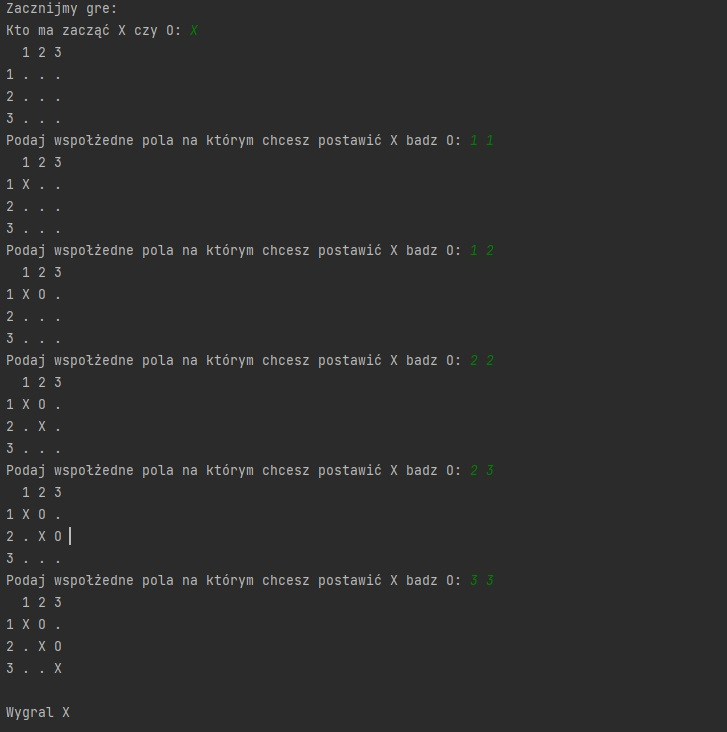

# TicTacToeGame

## Description

Console Tic Tac Toe game written in Python.
Choose player X or 0 to start.
Then choose place to put sign with coordinates:
3 1
or 2 3
etc.

## Features

- Choosing which players go first
- Gameplay
- Showing who won


## Screenshots




## Roadmap

- Additional error catching.


## Deployment and running

Clone the project.

Go to the project directory

```bash
  cd TicTacToeGame
```

Install and activate environment.

Run app via pyCharm.
